## Discord Anouncements Automation

Discord → GitHub Pages → Mintlify integration

1. Fetches Announcements from Discord

n8n workflow runs everyday (or triggered by webhook)
Retrieves last 10 messages from announcements channel

2. Formats and Processes Messages

Extracts content, author, timestamp from Discord messages
Sorts by newest first and sanitizes content
Creates JSON structure with announcements array

3. Updates GitHub Repository

Commits updated announcements.json to GitHub repo
GitHub Pages automatically serves the static HTML page
HTML page reads JSON and renders styled announcements

4. Displays in Mintlify Docs

Mintlify embeds GitHub Pages URL via iframe
No build scripts needed - just static embed
Auto-refreshes every 5 minutes to show latest updates

The entire flow is external to Mintlify, requiring only a simple iframe embed that points to the GitHub Pages URL. 
Updates happen automatically through n8n without any manual intervention.

## Architecture Flow

```mermaid
graph LR
    A[Discord<br/>Announcements<br/>Channel] -->|Webhook/API| B[n8n Workflow<br/>Every 30 min]
    
    B --> C{Process<br/>Messages}
    C --> D[Extract & Format<br/>- Content<br/>- Author<br/>- Timestamp]
    D --> E[Create JSON<br/>Structure]
    
    E --> F[GitHub API<br/>Update Files]
    F --> G[GitHub Repo<br/>- index.html<br/>- announcements.json]
    
    G -->|Auto Deploy| H[GitHub Pages<br/>Static Site]
    
    H -->|iframe embed| I[Mintlify Docs<br/>Display]
    
    I -.->|User Views| J[Live<br/>Announcements]
    
    style A fill:#5865F2,color:#fff
    style B fill:#ff6d5a,color:#fff
    style H fill:#24292e,color:#fff
    style I fill:#10b981,color:#fff
```

